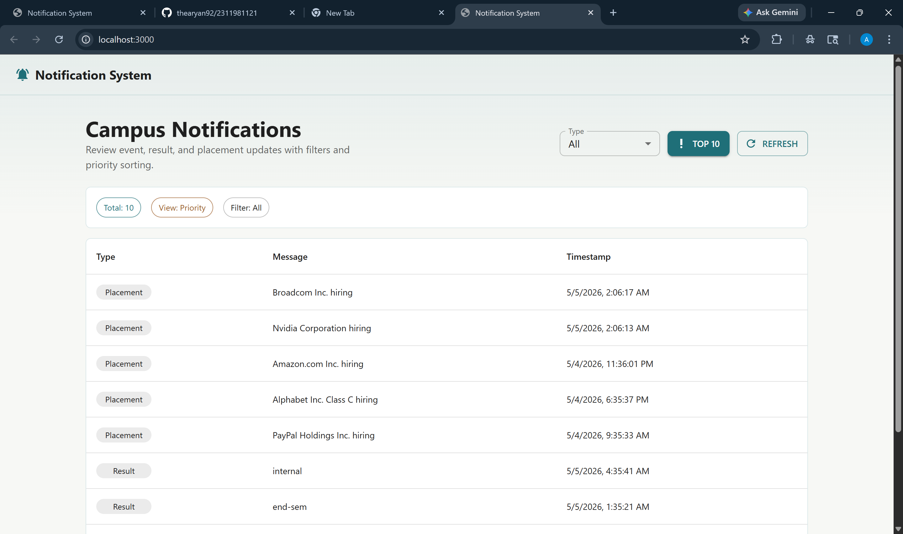
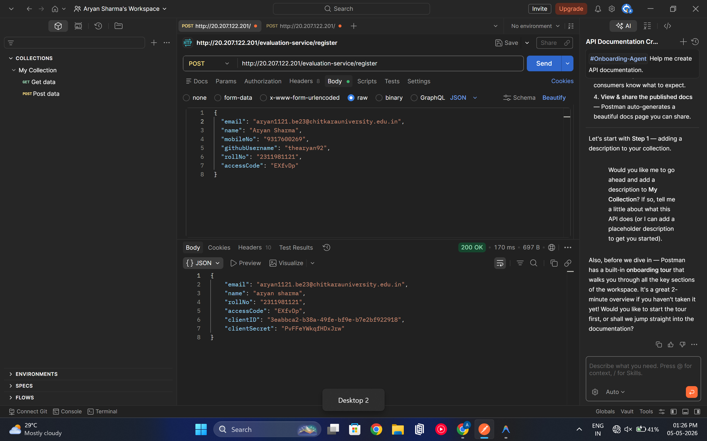
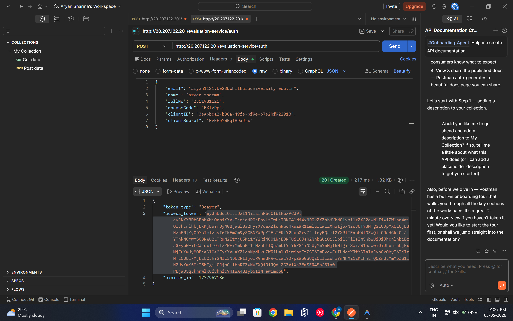
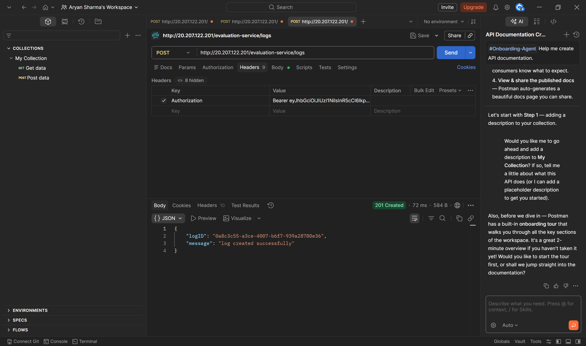
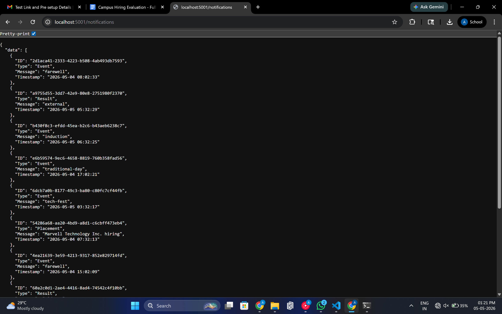

# Full Stack Notification System

A full-stack notification system built with **Node.js (Express)** for the backend and **React (Material UI)** for the frontend. The system fetches notifications from an external evaluation service, supports filtering, pagination, and priority-based sorting.

---

## Features

- Fetch notifications from external evaluation API
- Logging middleware integration
- Priority-based notification sorting: Placement > Result > Event
- Filter notifications by type: Event, Result, Placement
- Pagination support with configurable page size
- Top 10 priority notifications view
- Clean and responsive Material UI interface
- Environment-based configuration for tokens, ports, and API URLs

---

## Tech Stack

| Layer       | Technology                           |
|-------------|--------------------------------------|
| Backend     | Node.js, Express.js                  |
| Frontend    | React, Material UI                   |
| HTTP Client | Axios                                |
| Logging     | Custom middleware + External Log API |
| Bundler     | Vite                                 |

---

## Folder Structure

```text
2311981121/
|-- .env                          # Environment variables
|-- .gitignore                    # Git ignore rules
|-- README.md                     # Project documentation
|-- notification_system_design.md # System design document
|
|-- logging_middleware/           # Reusable logging module
|   |-- log.js                    # Log() function for external logging
|   `-- package.json
|
|-- notification_app_be/          # Backend Express API
|   |-- package.json
|   |-- package-lock.json
|   `-- src/
|       |-- app.js                # Express app configuration
|       |-- server.js             # Backend entry point
|       |-- controllers/
|       |   |-- logController.js
|       |   `-- notificationController.js
|       |-- middlewares/
|       |   `-- errorMiddleware.js
|       |-- routes/
|       |   |-- logRoutes.js
|       |   `-- notificationRoutes.js
|       `-- services/
|           |-- notificationService.js
|           `-- priorityService.js
|
|-- notification_app_fe/          # Frontend React app
|   |-- index.html
|   |-- package.json
|   |-- package-lock.json
|   `-- src/
|       |-- App.jsx               # Main React UI
|       |-- main.jsx              # React entry point
|       |-- styles.css            # App styles
|       |-- api/
|       |   `-- notificationsApi.js
|       `-- utils/
|           `-- log.js
|
`-- screenshots/                  # Screenshots for documentation
    |-- register.png
    |-- auth.png
    |-- log.png
    |-- backend.png
    |-- frontend.png
    `-- project.png
```

---

## Setup Instructions

### Prerequisites

- Node.js v18 or higher
- npm
- Valid access token for the evaluation service

### 1. Environment Setup

Create a `.env` file in the project root:

```env
ACCESS_TOKEN=YOUR_ACCESS_TOKEN_HERE
PORT=5001
FRONTEND_ORIGIN=http://localhost:3000
VITE_API_BASE_URL=http://localhost:5001
```

### 2. Backend

```bash
cd notification_app_be
npm install
npm start
```

Backend runs on:

```text
http://localhost:5001
```

### 3. Frontend

Open a second terminal:

```bash
cd notification_app_fe
npm install
npm start
```

Frontend runs on:

```text
http://localhost:3000
```

---

## API Endpoints

| Method | Endpoint         | Description                         |
|--------|------------------|-------------------------------------|
| GET    | `/health`        | Backend health check                |
| GET    | `/notifications` | Fetch notifications with filters    |
| POST   | `/logs`          | Send frontend logs to log service   |

### Notification Query Parameters

| Parameter | Example     | Description                         |
|-----------|-------------|-------------------------------------|
| `type`    | `Placement` | Filter by notification type         |
| `page`    | `1`         | Page number                         |
| `limit`   | `10`        | Number of notifications per page    |
| `priority`| `true`      | Return top priority notifications   |

Example:

```http
GET /notifications?type=Placement&page=1&limit=10
GET /notifications?priority=true
```

---

## Priority Logic

Notifications are sorted by:

1. **Type Priority**: Placement highest, then Result, then Event
2. **Timestamp**: Latest first within the same type

The priority view returns the top 10 notifications.

---

## Screenshots

### Project UI



### Register API



### Auth API



### Logging Middleware



### Backend API Response



### Frontend UI


---

## Important Notes

- **Logging Middleware**: Backend and frontend log events are sent through the custom `Log()` middleware.
- **Token Security**: The access token is stored in `.env` and loaded with `dotenv`.
- **Authorization**: External API requests use the `Authorization: Bearer <token>` header.
- **Error Handling**: Backend errors are returned in a standard JSON response.
- **Expired Token**: If the API returns `invalid authorization token`, update `ACCESS_TOKEN` in `.env` and restart the backend.

---

## Build Frontend

```bash
cd notification_app_fe
npm run build
```

---

## Author

**Aryan Sharma**  
Roll No: **2311981121**  
Chitkara University
